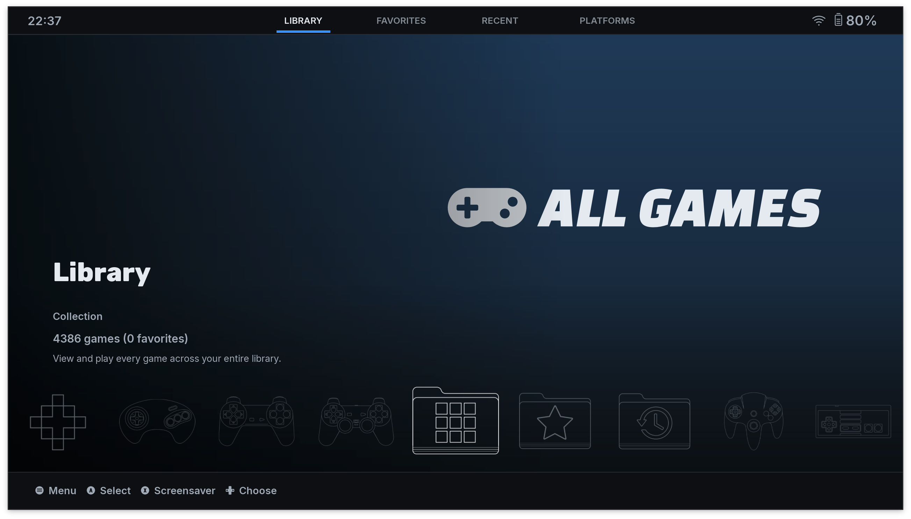
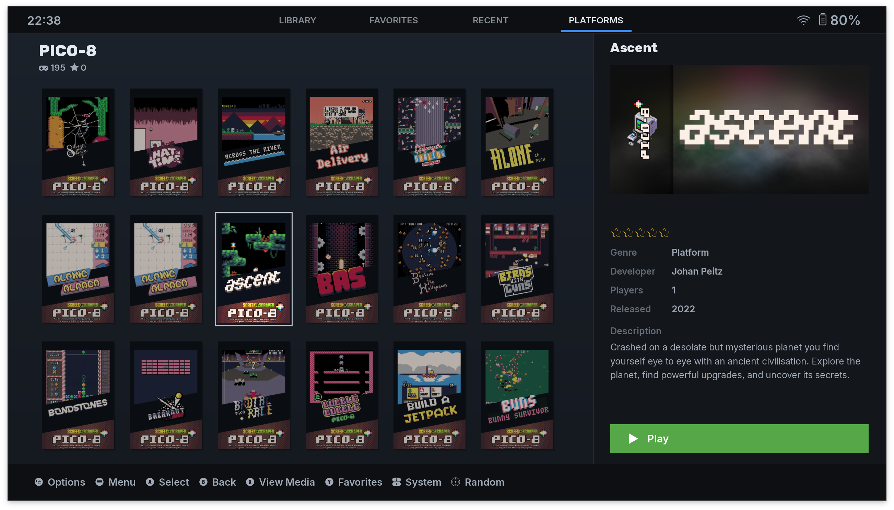
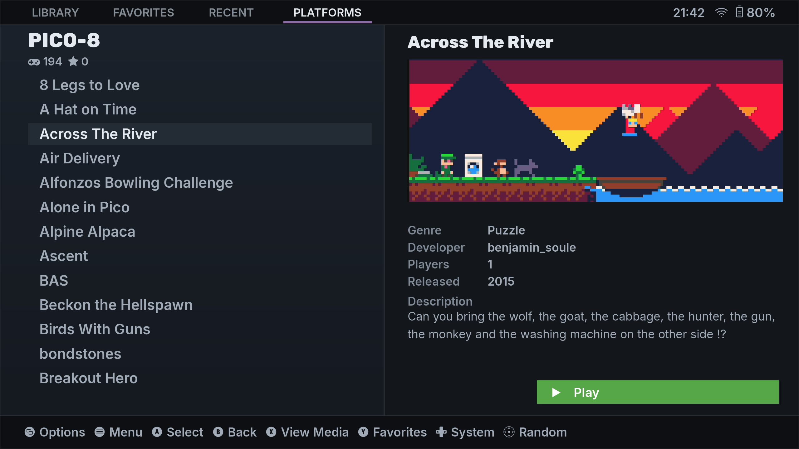
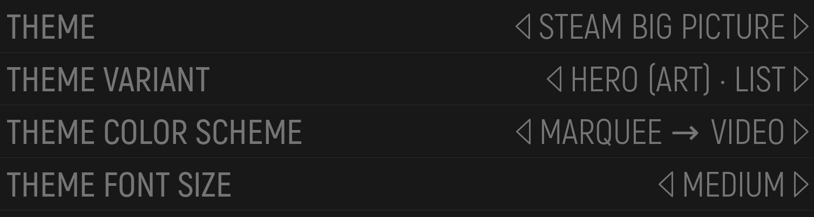
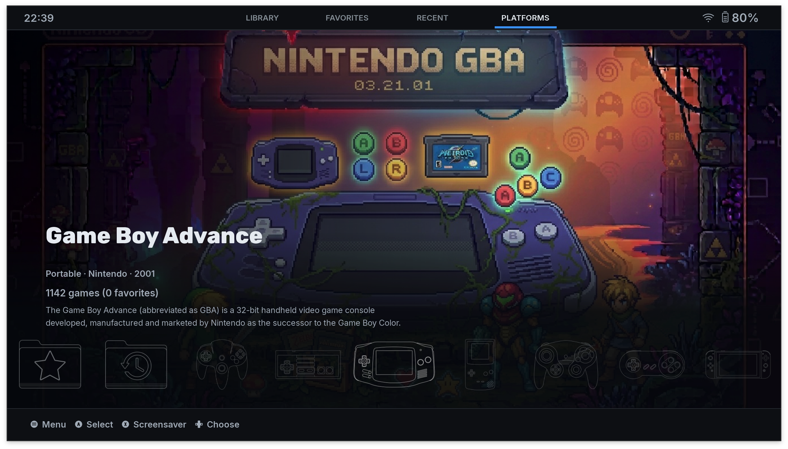

# Steam UI for ES-DE

A theme for [ES-DE](https://es-de.org/) (EmulationStation Desktop Edition) that recreates the modern Steam Big Picture / Steam Deck UI. The system view has a bottom rail of **full-colour system-logo capsules** over a dark, full-bleed hero — the focused system shown as a large white logo (collections as a clean white label) beside an info card with its details; the gamelist shows a capsule grid (or list) with a detail panel on the right. The palette is dark throughout — Steam's characteristic navy, with a Steam-blue accent on the active nav. Per-system colour comes through the rail capsules and a subtle hero tint. **ES-DE only** — runs on Steam Deck, desktop, and distros that bundle ES-DE (not a muOS/Knulli/ROCKNIX/Batocera theme).

It adapts to your display: a per-font-size type-and-density scale with a side-panel layout (grid/list left, detail panel right) across all supported aspect ratios — `16:9 / 16:10 / 4:3 / 5:4 / 3:2 / 5:3` and ultrawide `19.5:9 / 20:9 / 21:9`. Four variants (hero style × gamelist layout) combine with two color-scheme media modes.

---

## Requirements

- **ES-DE 2.0 or later** (developed and tested against 3.4.x). Handheld distros often bundle older builds — **below 3.x, expect rough edges**.
- `xmllint` is not required to run the theme; it is only used in development for XML validation.

---

## Install

1. **Enable automatic collections first.** The top nav (**Library / Favorites / Recent / Platforms**) is the Steam-style spine of this theme; the first three tabs are ES-DE *automatic collections*, off by default. Without them, three of four tabs show empty systems. In ES-DE: **Game Collection Settings → Enable automatic game collections** (see [Collections](#collections-library-favorites-recent)).
2. Download or clone this repository.
3. Copy (or symlink) `steam-ui/` into your ES-DE themes folder:
   - **Linux / macOS:** `~/ES-DE/themes/`
   - **Windows:** `%USERPROFILE%\ES-DE\themes\`
   - Custom data directory: `<your data path>/themes/`
4. Launch ES-DE, open **UI Settings → Theme**, and select **Steam UI**.

> **Small screens (5–6" handhelds):** the default **Medium** font size is the densest grid. For comfortable reading, set **UI Settings → Theme font size** to **Large** or **X-Large**.
>
> **Not in the ES-DE theme downloader yet** — manual install (above) required for now.

---

## Variants

Switch under **UI Settings → Theme variant**. There are **4 variants** — every combination of two independent choices. Default: **Hero (neon) · Grid**.

- **System view:** `Hero (neon)` (dark gradient hero + focus-tracked white system logo) · `Hero (art)` (per-platform background art — placeholder until you add art, see below)
- **Gamelist:** `Grid` (capsule grid + right detail panel) · `List` (scrollable list + wider detail panel)

| Variant | System hero | Gamelist |
| --- | --- | --- |
| Hero (neon) · Grid *(default)* | neon | grid |
| Hero (neon) · List | neon | list |
| Hero (art) · Grid | art | grid |
| Hero (art) · List | art | list |

---

## Detail media (color schemes)

The **color scheme** axis picks how the detail panel presents a game's media. The media is **cover-cropped to a fixed box** so every game uses the same footprint — which is why the chain is screenshot-first (wide marquees crop badly). Switch under **UI Settings → Theme color scheme** (both share the same dark palette). Default: **Screenshot → Video**.

| Color scheme | Behavior |
| --- | --- |
| **Screenshot → Video** *(default)* | screenshot still shows first, then the game's video auto-plays |
| **Screenshot (no video)** | screenshot still only — no video playback |

If the chosen still or video isn't scraped, the panel falls back to a placeholder.

---

## Theme font size

The theme scales typography **and** grid density together:

- **Medium** — densest grid, compact type.
- **Large** — fewer, larger capsules; wider detail panel with bigger video.
- **X-Large** — largest capsules and type; couch/TV distance.

---

## Aspect ratios

The same side-panel layout (grid/list left, detail panel right) is used across every supported aspect ratio — the grid packs more columns on wider screens:

- **First-class handhelds:** Steam Deck (`16:10`) and Windows handhelds — ROG Ally / Legion Go (`16:9`).
- **Also supported:** desktop/TV `4:3` and `5:4`; budget-handheld landscape `3:2` and `5:3` (Anbernic / Powkiddy / Miyoo class); phone-style ultrawide `19.5:9`, `20:9`, `21:9`.
- **Not yet supported:** square `1:1` (e.g. CubeXX, RGB30) and any **portrait** orientation — these need a different layout than the side-panel design.

---

## Collections (Library, Favorites, Recent)

The persistent **Library / Favorites / Recent / Platforms** nav strip at the top is the Steam-style spine of the UI. The first three tabs are ES-DE *automatic collections* — if you followed install step 1 you've already enabled them. Without them, those tabs show empty systems.

Enable in ES-DE under **Game Collection Settings → Enable automatic game collections**.

Once enabled, ES-DE aggregates games across all platforms as virtual systems and the Library / Favorites / Recent tabs come to life.

---

## Adding hero art

The "Hero (art)" variants show a placeholder until you add per-platform background art:

- **`docs/hero-art-pipeline.md`** — production workflow (canvas size, naming, export settings).
- **`steam-ui/systems/art/README.md`** — where to place files so the theme picks them up.

---

## Screenshots

### System view — Library collection (hero · neon)

### Gamelist — capsule grid with detail panel

### Gamelist — list with wide detail panel

### Theme settings (variant · color scheme · font size)

### System view — per-platform hero art *(after you add your own art)*

---

## Credits & License

Released under **CC BY-NC-SA 4.0**. See `LICENSE` for the full text.

Asset sources:

- **System logos:** ES-DE official asset repo (`gitlab.com/es-de/themes/system-logos`) — see its individual licenses.
- **System metadata & colors:** `gitlab.com/es-de/themes/system-metadata` (CC BY-NC-SA).
- **Fonts:** Inter (Rasmus Andersson) and Rubik — both SIL OFL 1.1.
- Logos and trademarks are the property of their respective owners.

See `ATTRIBUTION.md` for the full attribution list.
